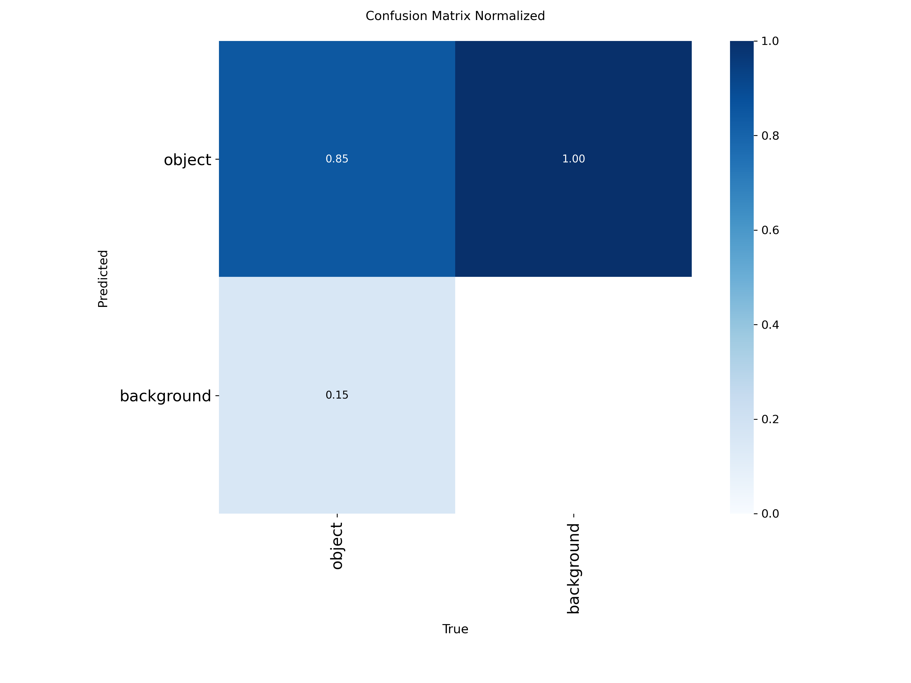

<p align="center">
  
</p>

## Motivación

La gestión de inventarios en entornos comerciales y logísticos modernos representa un desafío cada vez más complejo debido al alto volumen y diversidad de productos, la necesidad de mantener información actualizada en tiempo real y la reducción de errores humanos en los procesos de control de stock. Tradicionalmente, estas tareas se han realizado de forma manual o semiautomática, lo que conlleva costes elevados, falta de escalabilidad y una alta probabilidad de inconsistencias en los datos.

En los últimos años, los avances en visión por computador y aprendizaje profundo han demostrado un gran potencial para automatizar tareas de percepción visual como la detección, segmentación y reconocimiento de objetos. Modelos del estado del arte como YOLO, Segment Anything o CLIP permiten hoy en día abordar problemas que hasta hace poco requerían intervención humana directa.

Este trabajo surge de la motivación de explorar y aplicar estas tecnologías en un problema realista y de alto impacto práctico: la automatización del conteo y la gestión de inventario mediante sistemas de visión artificial. Además, se busca no solo implementar una solución funcional, sino también analizar, comparar y comprender las fortalezas y limitaciones de los distintos enfoques existentes, evaluando su viabilidad en escenarios reales de uso.

## Objetivos del Trabajo

### Objetivo General

Desarrollar y evaluar un sistema basado en visión por computador capaz de contar productos en estanterías, con el fin de automatizar tareas de control y gestión de inventario en entornos comerciales o logísticos.

### Objetivos Específicos

- Estudiar y aplicar modelos del estado del arte en detección y segmentación de objetos, como **YOLO y SAM**.  
- Entrenar y evaluar un modelo de detección sobre un dataset realista de alta densidad de objetos (**SKU110K**).  
- Integrar modelos multimodales como **CLIP** para el reconocimiento de productos mediante clasificación zero-shot.  
- Aplicar métodos de **clustering** como **K-Means y DBSCAN** sobre **embeddings de productos** reducidos con **PCA** para agruparlos automáticamente según su similitud visual.
- Diseñar un pipeline completo que permita:
  - Detectar productos en imágenes y vídeo.  
  - Clasificar productos y contar instancias
  - Realizar un seguimiento temporal para generar gráficos de evolución de inventario por producto y realizar predicciones sobre stock.
- Analizar el rendimiento de los distintos enfoques mediante métricas cuantitativas y comparativas experimentales.  
- Evaluar la viabilidad del uso de estos sistemas como apoyo a la gestión automática de inventario en escenarios reales.


## Descripción técnica del trabajo realizado

El pipeline propuesto para el sistema de gestión de inventario es el siguiente:

**Imágenes → Detección → Clasificación → Persistencia de resultados → Visualización de resultados**

De este modo, el primer paso del pipeline consiste en realizar la detección de los productos presentes en las imágenes. Para ello, se propone entrenar un modelo de detección de objetos en tiempo real basado en YOLOv8 de Ultralytics, adaptado al dataset específico de estanterías comerciales.

### Dataset y Entrenamiento del Modelo

#### Dataset SKU110K
El dataset SKU110K es un conjunto de imágenes de estanterías comerciales con alta densidad de productos, desarrollado para tareas de detección y conteo de objetos en entornos de retail. Contiene más de 11,000 imágenes y alrededor de 400,000 instancias de productos, etiquetadas mediante bounding boxes. Las imágenes incluyen múltiples desafíos típicos de inventario real, como superposición de productos, variaciones de iluminación, perspectivas diferentes, y oclusiones parciales, lo que lo convierte en un dataset adecuado para evaluar modelos de detección y segmentación en entornos logísticos.

El dataset SKU110K se organizó siguiendo la estructura estándar de YOLO:

```
.
├── images
│   ├── test
│   ├── train
│   └── val
└── labels
    ├── test
    ├── train
    └── val
```

**Training set:** Este subconjunto contiene 8,219 imágenes y sus anotaciones, utilizadas para entrenar los modelos de detección de objetos.  

**Validation set:** Este subconjunto consta de 588 imágenes y anotaciones, usadas para la validación del modelo durante el entrenamiento.  

**Test set:** Este subconjunto incluye 2,936 imágenes, diseñadas para la evaluación final de los modelos entrenados de detección de objetos.

**Archivo YAML oficial para el entrenamiento con Ultralytics:** [Ver aquí](https://docs.ultralytics.com/datasets/detect/sku-110k/#dataset-yaml)  
**Artículo original del dataset SKU110K:** [**Goldman, E., Herzig, R., Eisenschtat, A., Goldberger, J., & Hassner, T. (2019).** *Precise Detection in Densely Packed Scenes.* In *Proceedings of the Conference on Computer Vision and Pattern Recognition (CVPR).*](https://arxiv.org/pdf/1904.00853)


#### Modelo y entrenamiento
Se utilizó un modelo base **YOLOv8n** preentrenado en COCO, adaptado al dataset.  El entrenamiento se realizó durante 10 épocas con imágenes de 640×640 píxeles y batch size de 8. 

El modelo resultante se guarda en: `yolov8_train_results/content/runs/detect/train/weights/best.pt`

---

### Resultados del Entrenamiento

Durante el proceso de entrenamiento se generaron diversas gráficas que permiten analizar el rendimiento del modelo.

A continuación se incluyen los enlaces a las principales métricas visuales:

| Métrica | Imagen |
|----------|--------|
| F1-Score vs Confidence |  |
| Precision vs Confidence |  |
| Precision vs Recall |  |
| Recall vs Confidence |  |
| Confusion Matrix |  |
| Confusion Matrix (Normalized) |  |
| Labels |  |
| Other metrics |  |

A continuación se muestran ejemplos del conjunto de entrenamiento y validación, generados automáticamente por YOLO:

| Tipo | Imagen |
|------|---------|
| Ejemplo de batch de entrenamiento (1) |  |
| Ejemplo de batch de entrenamiento (2) |  |
| Ejemplo de batch de entrenamiento (3) |  |
| Etiquetas del conjunto de validación |  |
| Predicciones del conjunto de validación |  |

---

### Evaluación del Modelo

La validación se realizó sobre el conjunto de prueba (split *test*), utilizando el modelo **YOLOv8n** entrenado.

**Resumen del rendimiento final:**

| Métrica | Valor |
|---------|-------|
| Precisión (Box Accuracy) | 88.3% |
| Sensibilidad (Recall) | 80.4% |
| Precisión media (mAP@50) | 87.8% |
| Precisión media (mAP@50–95) | 54.9% |
| Box Loss final | 1.395 |
| Class Loss final | 0.662 |
| DFL Loss final | 0.998 |
| GPU utilizada | Tesla T4 (15GB) |
| Parámetros del modelo | 3,005,843 |
| FLOPs | 8.1 GFLOPs |

**Notas adicionales:**
- El optimizador se seleccionó automáticamente (AdamW), ajustando `lr` y `momentum` de forma óptima.  
- Se aplicaron transformaciones de aumento de datos leves durante el entrenamiento, incluyendo blur, median blur, conversión a gris y CLAHE con baja probabilidad, para mejorar la generalización.  
- El modelo validado mostró consistencia entre las métricas de precisión y recall a lo largo de los 10 epochs, indicando buen balance entre detección de objetos y control de falsos positivos.

Una vez entrenado el modelo **YOLOv8**, este es capaz de detectar los productos presentes en la escena con una **precisión del 88.3%**.  

A continuación se muestran ejemplos de detecciones en diferentes secciones de un comercio, ilustrando el rendimiento del modelo:


En un principio, conocer la cantidad total de productos es relativamente sencillo: basta con contar la cantidad de **bounding boxes** detectadas en la imagen.

| SECCIÓN               | PRODUCTOS |
|----------------------|-----------|
| SECCION-ALIMENTOS-1  | 141       |
| SECCION-ALIMENTOS-2  | 164       |
| SECCION-ASEO-1       | 130       |
| SECCION-ASEO-2       | 123       |
| SECCION-BEBIDAS-1    | 179       |
| SECCION-BEBIDAS-2    | 134       |
| SECCION-BEBIDAS-3    | 148       |
| SECCION-LIMPIEZA-1   | 252       |
| SECCION-LIMPIEZA-2   | 252       |
| SECCION-LIMPIEZA-3   | 236       |
| SECCION-MEDICAMENTOS-1 | 144     |

### Utilizacion de SAM para la realizacion de deteccionoes

TODO: PENDIENTE REDACTAR

---

### Procesamiento de Imagenes

El siguiente desafío consiste en **clasificar cada uno de los productos detectados**. Para ello, se plantean dos enfoques:

1. **Clasificación zero-shot mediante un modelo multimodal (CLIP):**  
   Este enfoque permite asignar etiquetas a los productos sin necesidad de un entrenamiento específico para cada categoría, aprovechando la capacidad del modelo de relacionar imágenes y texto de manera directa.

2. **Comparación de embeddings generados por modelos self-supervised (DINOv2):**  
   Este método consiste en representar cada producto mediante un embedding visual y comparar estas representaciones entre sí, permitiendo agrupar o identificar productos similares basándose en su similitud en el espacio de características aprendido.

#### OpenCLIP (LAION-2B)

El dataset **LAION-5B** es un conjunto masivo de **5,85 mil millones de pares imagen-texto**, desarrollado para investigación en modelos multimodales a gran escala. Representa un incremento de más de 14 veces respecto a su predecesor, **LAION-400M**, anteriormente el dataset abierto más grande del mundo. Aproximadamente 2,3 mil millones de muestras están en inglés, 2,2 mil millones en más de 100 idiomas adicionales, y 1 mil millón contiene textos sin asignación lingüística clara (por ejemplo, nombres propios).  

LAION-5B ha sido diseñado para permitir la investigación de modelos de imagen-texto a gran escala, y ha servido como base para entrenar modelos tipo CLIP de manera reproducible y accesible públicamente.

**Artículo original sobre CLIP y LAION-5B:** [**Radford, A., Kim, J. W., Hallacy, C., Ramesh, A., Goh, G. et al. (2021).** *Learning Transferable Visual Models From Natural Language Supervision.* In *International Conference on Machine Learning (ICML).*](https://laion.ai/blog/laion-5b/)

Para la identificación de productos, se utilizaron los modelos **CLIP ViT-B/32 y CLIP ViT-L/14 entrenado con LAION-2B**, un **subconjunto filtrado de LAION-5B** que contiene pares imagen-texto seleccionados mediante CLIP para un tamaño más manejable y para facilitar el entrenamiento reproducible de modelos zero-shot.  

Estos modelos genera embeddings de imagen y texto que permiten realizar clasificación **zero-shot** de ROIs detectados por YOLO. 

#### DINOv2

DINOv2 es un modelo **self-supervised** para aprendizaje de representaciones visuales, capaz de generar embeddings de alta calidad que permitirá **comparar productos y realizar análisis mediante clustering** de los objetos detectados.

**Artículo original sobre DINOv2:** [**Oquab, M., Darcet, T., Moutakanni, T., Vo, H., Szafraniec, M. et al. (2023).** *DINOv2: Learning Robust Visual Features without Supervision.* In Transactions on Machine Learning Research (TMLR).*](https://arxiv.org/pdf/2304.07193)

En este trabajo, los embeddings generados por DINOv2 se utilizan para representar cada producto detectado por YOLO, permitiendo aplicar técnicas de **clustering y comparación de similitud** entre productos, lo que facilita la agrupación automática y el análisis de inventario visual.

---

### Resultados Obtenidos

Se ponen a prueba ambos enfoques sobre una serie de imagenes capturadas en diferentes secciones de un comercio.

- Detección de productos utilizando YOLO8v (detección).  
- Detección de productos utilizando SAM3 (segmentación).
- Reconocimiento del producto mediante **CLIP‑ViT‑B/32**.  
- Generación de un **archivo CSV** con todas comparaciones.

- **Imagenes originales:** [productos.mp4](https://drive.google.com/file/)  
- **Imagenes procesadas (resultados):** [detecciones.mp4](https://drive.google.com/file/)
- **Archivo CSV generado:** [out/reporte_final.csv](out/reporte_final.csv)

El archivo `reporte_final.csv` incluye, para cada detección:  
imagen fuente (seccion/camara), tipo de objeto (solo object), confianza, identificador de tracking, coordenadas de la caja delimitadora, producto reconocido, resultados lvm con sus respectivas confianzas.

---

### Ánalisis de resutados y comparativa de las distintas metodologías.

Se evaluaron dos métodos de reconocimiento de texto:

| Tipo de Métrica       | Descripción                                                    | YOLO             | SAM + LVM         |
|-----------------------|----------------------------------------------------------------|------------------|-------------------|
| **Total de Muestras** | Número de imagenes evaluadas                                   | **31**           | **31**            |
| **Deteccion Exacta**  | La cantidad predicha coincide exactamente con la cantidad real | **xx.x% (x/31)** | **xx.xx% (x/31)** |
| **Deteccion Parcial** | Porcentaje de deteccion sobre la cantidad real.                | **xx.xx%**       | **xx.xx%**        |


**Datos de evaluacion:** [Descargar desde Google Drive]()

**Conclusiones:**

---

## Conclusiones finales

---

### Propuestas de ampliación

- Desarrollo de aplicacion full-stack que integre todo y aporte una UI.  
- Integración con **LLM's** para generar reportes automáticos y alertas detalladas.    

---

## Fuentes y tecnologías utilizadas

- **YOLOv8 y YOLOv11**: para detección de objetos en imágenes y vídeo, adaptado al dataset SKU110K.  
- **SAM2 y SAM3 (Segment Anything Model)**: para segmentación automática de productos en estanterías.  
- **OpenCLIP (ViT-B/32 y ViT-L/14)**: para reconocimiento y clasificación zero-shot de productos mediante embeddings multimodales.  
- **DINOv2 y DINOv3**: para extracción de características visuales y análisis de similitudes entre productos.  
- **K-Means, DBSCAN, PCA y UMAP**: para agrupamiento automático de productos según sus embeddings visuales.  
- **PyTorch, OpenCV, scikit-learn y Ultralytics**: frameworks y librerías para entrenamiento, procesamiento de imágenes y visualización de resultados.


---

## Indicación de herramientas/tecnologías con las que se hubiera gustado contar

- **GPU de mayor capacidad** para acelerar entrenamientos de modelos grandes y experimentos con múltiples configuraciones.  
- **Datasets de retail con máscaras de segmentación**, en lugar de solo bounding boxes, que permitieran entrenar y evaluar modelos de segmentación más precisos.  

---

## Repositorio y codigo fuente:

https://github.com/gcprado/vc/edit/main/IMS